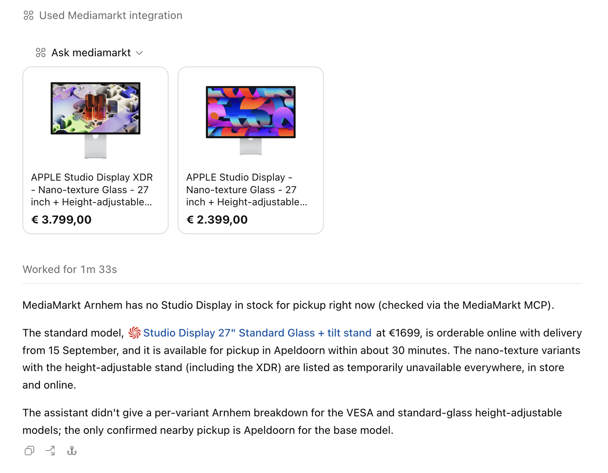

# mediamarkt-mcp

MCP server that exposes MediaMarkt NL's "AI-modus" shopping assistant as one tool, `ask_mediamarkt`.



*ChatGPT calling `ask_mediamarkt` with `MEDIAMARKT_UI=widget`: the MCP Apps carousel shows the products, the model uses the text answer.*

## How it works

The MediaMarkt site's chat widget POSTs to `https://www.mediamarkt.nl/api/v1/ai-chat` (Vercel AI SDK UI-message format, SSE response). No login or cookies are needed, only `x-mms-country/-language/-salesline` headers and a browser User-Agent. The assistant runs its own tools (search, compare, availability, stores) and streams back MCP-style tool results; this server collects the text answer plus the structured product list (with images).

Unofficial endpoint: it can change or be blocked at any time. See MediaMarkt's [AI chatbot terms](https://www.mediamarkt.nl/nl/legal/gebruiksvoorwaarden-ai-chatbot).

## Install

```sh
npm install
npm run check   # live smoke test against mediamarkt.nl
```

## Run

Streamable HTTP is the default (stateless, works for ChatGPT, Codex, Claude):

```sh
node index.mjs                       # http://localhost:3000
PORT=8080 node index.mjs
MEDIAMARKT_UI=widget node index.mjs  # also serve the product carousel UI (MCP Apps)
node index.mjs --stdio               # stdio transport instead
```

Settings (environment):

| Variable        | Values              | Default | Effect |
| --------------- | ------------------- | ------- | ------ |
| `PORT`          | number              | `3000`  | HTTP port |
| `MEDIAMARKT_UI` | `text` \| `widget` | `text`  | `widget` attaches an [MCP Apps](https://modelcontextprotocol.io/docs/extensions/apps) product carousel (`ui://mediamarkt/product-carousel.html`) to the tool; hosts that render MCP Apps (ChatGPT) show product cards with image, name, price and link, other hosts just get the text |

## Connect

```sh
codex mcp add mediamarkt --url http://localhost:3000
```

For ChatGPT, expose the HTTP server publicly (e.g. `cloudflared tunnel --url http://localhost:3000`) and add the URL under Settings → Apps in developer mode. Run with `MEDIAMARKT_UI=widget` to get the carousel.

## Tool

`ask_mediamarkt({ question, language? })` — `language` is `en` (default) or `nl`; the answer follows the question's language, `en` also switches product names and URLs to the English storefront. Returns `content[0].text` (the assistant's answer) and `structuredContent.products[]` (`productId`, `ean`, `name`, `brand`, `price`, `currency`, `deliveryTime`, `url`, `image`).
